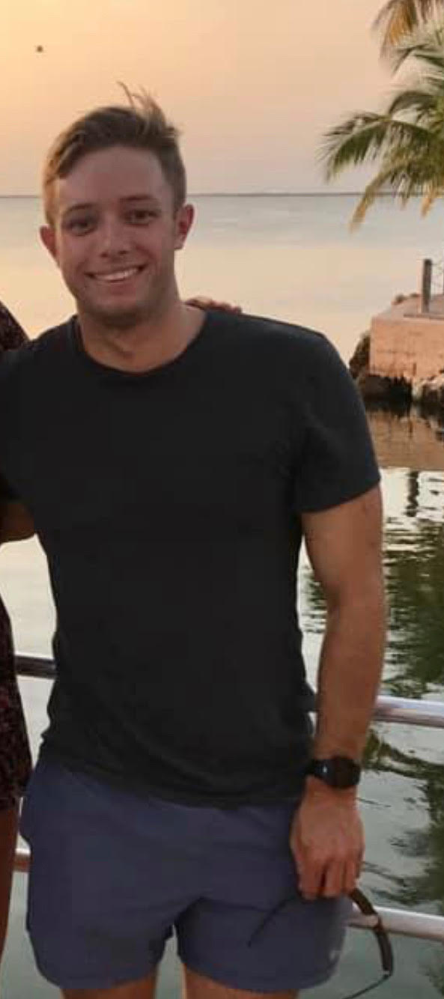

## A Bit About Myself
I am a first year PhD student working in Dr. Erin Lipp's laboratory in the Environmental Health Science department. I am originally from the suburbs of Virginia just outside of the capital, however the past five years I have been living and working in the Florida Keys. I received my BS in Biology in 2012 from the University of Mary Washington where I focused on the ecology of aquatic organisms. In 2015, I received my MS in Environmental Science and Policy from George Mason University. My master's research focused on the ecology and transmission of the Caribbean coral disease known as White Band Disease. I utlized a combination of histology, diving surveys, and fluorescence _in situ_ hybridization to investigate the health impacts of the corallivorous fish _Stegastes planifrons_. Following my master's research, I worked as a scientific diver for the Coral Restoration Foundation where we cultivated critically endangered coral species for transplantation onto the Florida Keys Reef Tract. Most recently, I worked as a marine science instructor for the Marine Resources Development Foundation which is an environmental education non-profit located in Key Largo. After a long stint working in the field, I am excited to begin my career at UGA. Though my specific PhD topic is still a work in progress, I have a strong desire to continue working with aquatic pathogens and I am particularly interested in the effects of anthropogenic disturbance on the ecology of these organisms.


```{r me, out.height = "30%", out.width = "30%", echo=FALSE}
 
```

## Coral Restoration Work
My experience with the Coral Restoration Foundation was largely focused on the cultivation and transplantation of two critically endangered corals back to the Florida Reef Tract: staghorn coral _Acropora cervicornis_ and elkhorn coral _Acropora palmata_. The coral nursery was maintained offshore in a sand patch parallel with the main reef tract. Corals were cultivated on coral "trees" where larger colonies were fragmented (broken into small pieces) and allowed to grow to a mature size suspended in the water. Some of the greatest challenges we experienced occurred on planting days. Corals had to be harvested from the trees and transported in large plastic bins via boat to the restoration site. Corals would often collapse if transporation was delayed or the abiotic conditions of the storage water deteriorated during transit. One of the fundamental goals of the foundation was to replenish coral populations on the reef to viably reproductive levels. To assist survival, corals were selectively bred to be resistant to disease and research was in progress to select for corals resistant to climate change and ocean acidification. 


## Prior Data Analysis and Programming Experience
My background in data analysis and statistics is relatively minimal. I do have some analysis training from my master's thesis and a prior course in SPSS, however the majorty of my experience is fairly simplistic. With regards to R specifically, this course will be my first exposure to the program and is the primary reason for my interest in the course. My hope is to gain a solid foundation in the usage of R as an analytical tool so I can utlize the program when I reach the data analysis point of my PhD research. 

## Interesting Fact
One interesting fact about myself is that I am an avid SCUBA diver. I have a slew recreational, technical, and professional certifications and I have logged just over 900 total dives to date.The image below is from one of my favorite dives and was taken during a coral spawning night dive in 2015. 

```{r diving, out.height = "30%", out.width = "30%", fig.align='center', echo=FALSE}
knitr::include_graphics("Norfolk_Image_2.jpg") 
```


## Data Analysis Links
Throughout the course of this assignment I found two things that I thought would be of use or interesting to everyone as they worked on their introduction. The first is a great cheat sheet for commonly used syntax in R Markdown. The link to this sheet can be found [here](https://www.rstudio.com/wp-content/uploads/2015/02/rmarkdown-cheatsheet.pdf). As someone who has never used R before, I found this sheet to be very useful as I started to navigate some of the common syntax. I hope it is helpful to the rest of the class as well! 

The second link is for an article published in _Nature_ in 2016 about some of the challenges faced by researchers in the modern days of data transparency. The link for the article can be found [here](https://www.nature.com/news/research-integrity-don-t-let-transparency-damage-science-1.19219). The article largely focuses on various discussion points about how freely-accessible data can both be very useful to the scientific process, and  potentially harmful in the wrong hands. I apologize in advance if the article is a bit of a depressing read at times as it is cautionary; however I think it brings up some interesting points about public misconception of scientific data. I also think the article connects well with the Rodger Peng video and his discussion about the importance of reproducible data and methods.


